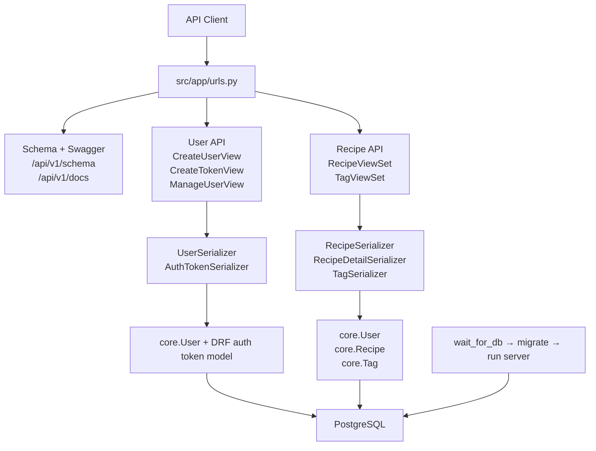

# Cooking Recipe API

> Django REST API for user registration, token-based authentication, and per-user recipe/tag management backed by PostgreSQL.

[](https://github.com/dongju93/cooking-recipe-api/actions/workflows/checks.yaml)

---

## Table of Contents

- [Overview](#overview)
- [Architecture](#architecture)
- [Tech Stack](#tech-stack)
- [Project Structure](#project-structure)
- [Core Capabilities](#core-capabilities)
- [Runtime Entry Points](#runtime-entry-points)
- [External Integrations](#external-integrations)
- [Getting Started](#getting-started)
- [API Reference](#api-reference)
- [Testing](#testing)
- [Deployment](#deployment)
- [Design Patterns and Conventions](#design-patterns-and-conventions)
- [Troubleshooting](#troubleshooting)
- [Existing Documentation](#existing-documentation)
- [Contributing](#contributing)
- [License](#license)

---

## Overview

`cooking-recipe-api` is a single-service Django application that exposes a versioned REST API under `api/v1/`.

The repository currently implements:

- public user registration
- token issuance for API authentication
- authenticated profile retrieval and update
- authenticated recipe CRUD
- authenticated tag listing, rename, and deletion
- OpenAPI schema generation and Swagger UI
- Django admin integration for the custom user model and recipe data

The codebase is a layered Django monolith rather than a monorepo or multi-service system. Routing and framework configuration live in `src/app`, API-facing logic lives in `src/user` and `src/recipe`, and persistent domain models live in `src/core`.

## Architecture

The application follows a straightforward Django/DRF flow:

1. `src/manage.py` or a WSGI/ASGI server boots Django with `app.settings`.
2. `src/app/urls.py` routes requests to explicit user views, router-generated recipe/tag viewsets, or schema/documentation views.
3. DRF serializers validate request data and shape responses.
4. Views and viewsets inject authenticated user context and enforce per-user scoping.
5. Django ORM models in `src/core/models.py` persist data to PostgreSQL.

Observed architectural characteristics:

- Layered monolith: `urls -> views/viewsets -> serializers -> ORM models`.
- No separate service or repository layer.
- Authentication and authorization are configured per view, not globally.
- Multi-tenant isolation is enforced by filtering querysets on `request.user`.
- Tag creation is embedded in recipe creation through nested serializer handling.

### System Diagram



### Runtime Modes

- HTTP server:
  `uv run python src/manage.py runserver 0.0.0.0:8080` for local development.
- WSGI/ASGI application:
  `src/app/wsgi.py` and `src/app/asgi.py` expose `application`.
- CLI / admin commands:
  `src/manage.py` is the Django command entry point.
- Startup guard:
  `python manage.py wait_for_db` blocks until PostgreSQL is reachable.

No background workers, queue consumers, scheduled jobs, serverless handlers, or separate CLI applications were found in the repository.

## Tech Stack

| Layer                      | Technology                                     | Purpose                                                       |
| -------------------------- | ---------------------------------------------- | ------------------------------------------------------------- |
| Runtime                    | Python 3.14 recommended, `>=3.13` required     | Application runtime (`.python-version`, `pyproject.toml`)     |
| Web Framework              | Django 6.0.3                                   | Core web framework, ORM, admin, settings, management commands |
| API Framework              | Django REST Framework 3.16.1                   | API views, viewsets, serializers, token auth integration      |
| API Documentation          | drf-spectacular 0.29.0                         | OpenAPI schema and Swagger UI                                 |
| Database                   | PostgreSQL + `psycopg` 3.3.3                   | Primary relational datastore                                  |
| Auth                       | Custom `core.User` + DRF `TokenAuthentication` | Email-based login and authenticated API access                |
| Dependency / Build Tooling | `uv`                                           | Dependency sync and local command runner                      |
| Quality Tooling            | Ruff, pyrefly                                  | Formatting, linting, static type checking                     |
| Container Runtime          | Docker, Docker Compose                         | Local containerized app + database workflow                   |
| CI                         | GitHub Actions                                 | Push-triggered test and lint automation                       |

## Project Structure

```text
cooking-recipe-api/
├── .github/
│   └── workflows/
│       └── checks.yaml
├── deploy/
│   └── postgresql/
│       ├── .env.local
│       └── docker-compose.yaml
├── src/
│   ├── app/
│   │   ├── asgi.py
│   │   ├── calc.py
│   │   ├── settings.py
│   │   ├── tests/
│   │   ├── urls.py
│   │   └── wsgi.py
│   ├── core/
│   │   ├── management/
│   │   ├── migrations/
│   │   ├── tests/
│   │   ├── admin.py
│   │   └── models.py
│   ├── recipe/
│   │   ├── tests/
│   │   ├── serializers.py
│   │   ├── urls.py
│   │   └── views.py
│   ├── user/
│   │   ├── tests/
│   │   ├── serializers.py
│   │   ├── urls.py
│   │   └── views.py
│   ├── .env.local.example
│   └── manage.py
├── Dockerfile
├── docker-compose.yaml
├── code_quality.sh
├── dev_server.sh
├── pyproject.toml
├── pyrightconfig.json
└── uv.lock
```

Non-obvious directories and files:

- `src/app/`: Django configuration package, not a feature app. It owns settings, root URL registration, and WSGI/ASGI entry points.
- `src/core/`: shared domain and persistence layer. The custom user model, `Recipe`, `Tag`, admin configuration, and the `wait_for_db` management command all live here.
- `src/user/`: authentication and profile API surface.
- `src/recipe/`: recipe and tag API surface.
- `deploy/postgresql/`: standalone PostgreSQL compose stack for local database-only usage.
- `src/app/calc.py`: small utility module covered by unit tests; it is not wired into the HTTP API.

## Core Capabilities

- User registration with email and password hashing.
- Token issuance through `POST /api/v1/user/token`.
- Authenticated self-service profile read/update through `GET|PUT|PATCH /api/v1/user/me`.
- Per-user recipe CRUD with ownership enforced in `RecipeViewSet.get_queryset()`.
- Nested tag assignment on recipe creation via `Tag.objects.get_or_create(...)`.
- Per-user tag listing, rename, and deletion through `TagViewSet`.
- Generated OpenAPI schema and Swagger UI.
- Django admin support for `User`, `Recipe`, and `Tag`.

## Runtime Entry Points

| Entry Point                                   | Type                         | What It Starts                                                                                          |
| --------------------------------------------- | ---------------------------- | ------------------------------------------------------------------------------------------------------- |
| `src/manage.py`                               | CLI entry                    | Django management commands, including `runserver`, `migrate`, `test`, and custom commands               |
| `src/app/wsgi.py`                             | WSGI callable                | Synchronous WSGI application object                                                                     |
| `src/app/asgi.py`                             | ASGI callable                | ASGI application object                                                                                 |
| `src/core/management/commands/wait_for_db.py` | Management command           | Database readiness loop used before migrations/server startup                                           |
| `dev_server.sh`                               | Local startup script         | `wait_for_db`, `migrate`, then Django dev server on `0.0.0.0:8080`                                      |
| `docker-compose.yaml`                         | Container startup definition | `recipe_api` service that runs `wait_for_db`, `migrate`, and Django dev server on container port `8000` |

## External Integrations

Observed integrations are limited and infrastructure-focused:

- PostgreSQL as the sole application datastore.
- DRF token authentication via `rest_framework.authtoken`.
- drf-spectacular for schema generation and Swagger UI.
- GitHub Actions for CI.
- Docker Hub login inside CI before Docker Compose-based checks run.

No Redis, message broker, object storage, payment gateway, search engine, or external HTTP API integrations were found in the repository.

## Getting Started

### Prerequisites

- Python `>=3.13` and preferably `3.14`
- `uv`
- PostgreSQL if running outside Docker
- Docker Engine with the Compose plugin if running the containerized workflow

### Environment Variables

`src/app/settings.py` loads `src/.env.local` and reads configuration from process environment. The example file is `src/.env.local.example`.

| Variable            | Required           | Default                                                     | Description                                |
| ------------------- | ------------------ | ----------------------------------------------------------- | ------------------------------------------ |
| `POSTGRES_DB`       | yes                | none                                                        | PostgreSQL database name                   |
| `POSTGRES_USER`     | yes                | none                                                        | PostgreSQL user                            |
| `POSTGRES_PASSWORD` | yes                | none                                                        | PostgreSQL password                        |
| `POSTGRES_HOST`     | yes for local runs | none                                                        | PostgreSQL host for local Django execution |
| `POSTGRES_PORT`     | yes for local runs | none                                                        | PostgreSQL port for local Django execution |
| `SECRET_KEY`        | yes                | none                                                        | Django secret key                          |
| `DEBUG`             | no                 | `True` in settings, `False` in Compose/CI unless overridden | Django debug flag                          |
| `ALLOWED_HOSTS`     | no                 | empty string in settings                                    | Comma-separated allowed hostnames          |

Notes:

- The root `docker-compose.yaml` injects `POSTGRES_HOST=recipe_postgres` and `POSTGRES_PORT=5432` into the app container, so those two values do not need to be present in the root `.env` file for the main Compose stack.
- The local Django workflow expects `src/.env.local`.
- The standalone DB stack in `deploy/postgresql/` exposes PostgreSQL on host port `5436`.

### Installation

#### Local Python environment

```bash
cp src/.env.local.example src/.env.local
uv sync --frozen --dev
```

Then edit `src/.env.local` with values for your local PostgreSQL instance.

If you want a disposable PostgreSQL instance without running the full app stack:

```bash
docker compose -f deploy/postgresql/docker-compose.yaml up -d
```

When using that database-only stack, set `POSTGRES_HOST=127.0.0.1` and `POSTGRES_PORT=5436` in `src/.env.local`.

#### Docker Compose stack

Create a root `.env` file for the variables referenced by `docker-compose.yaml`:

```bash
cat > .env <<'EOF'
POSTGRES_DB=recipe
POSTGRES_USER=dev
POSTGRES_PASSWORD=change-me
SECRET_KEY=change-me
DEBUG=True
ALLOWED_HOSTS=localhost,127.0.0.1
EOF
```

### Running

#### Local development

```bash
./dev_server.sh
```

Equivalent manual startup:

```bash
uv run python src/manage.py wait_for_db
uv run python src/manage.py migrate
uv run python src/manage.py runserver 0.0.0.0:8080
```

#### Docker Compose

```bash
docker compose up --build
```

The API is then available at `http://localhost:8080`.

#### Production-style container build

The repository includes a multi-stage `Dockerfile`, but it does not provide a production app server command such as Gunicorn or Uvicorn, and the default container `CMD` is commented out. As checked into the repo, deployment automation stops at image build plus local Compose orchestration.

## API Reference

The repository exposes both route definitions and generated schema/docs:

- OpenAPI schema: `GET /api/v1/schema`
- Swagger UI: `GET /api/v1/docs`

### User API

| Method          | Path                  | Auth   | Handler           | Notes                               |
| --------------- | --------------------- | ------ | ----------------- | ----------------------------------- |
| `POST`          | `/api/v1/user/create` | public | `CreateUserView`  | Creates a user with hashed password |
| `POST`          | `/api/v1/user/token`  | public | `CreateTokenView` | Returns a DRF auth token            |
| `GET`           | `/api/v1/user/me`     | token  | `ManageUserView`  | Returns the authenticated user      |
| `PUT` / `PATCH` | `/api/v1/user/me`     | token  | `ManageUserView`  | Updates the authenticated user      |

Example request and response for user creation:

```http
POST /api/v1/user/create
Content-Type: application/json

{
  "email": "test@example.com",
  "password": "testpass123",
  "name": "Test User"
}
```

```json
{
  "email": "test@example.com",
  "name": "Test User"
}
```

Example token exchange:

```http
POST /api/v1/user/token
Content-Type: application/json

{
  "email": "test@example.com",
  "password": "testpass123"
}
```

```json
{
  "token": "<opaque-token>"
}
```

### Recipe API

The recipe app is mounted at `/api/v1/recipe/` and uses a DRF `DefaultRouter`, so recipe and tag resources keep trailing slashes even though `APPEND_SLASH = False`.

| Method                             | Path                           | Auth   | Handler         | Notes                             |
| ---------------------------------- | ------------------------------ | ------ | --------------- | --------------------------------- |
| `GET`                              | `/api/v1/recipe/`              | public | router API root | Lists router-registered resources |
| `GET` / `POST`                     | `/api/v1/recipe/recipes/`      | token  | `RecipeViewSet` | Lists or creates recipes          |
| `GET` / `PUT` / `PATCH` / `DELETE` | `/api/v1/recipe/recipes/{id}/` | token  | `RecipeViewSet` | Recipe detail and mutations       |
| `GET`                              | `/api/v1/recipe/tags/`         | token  | `TagViewSet`    | Lists tags                        |
| `PUT` / `PATCH` / `DELETE`         | `/api/v1/recipe/tags/{id}/`    | token  | `TagViewSet`    | Renames or deletes a tag          |

Example recipe create request:

```http
POST /api/v1/recipe/recipes/
Authorization: Token <opaque-token>
Content-Type: application/json

{
  "title": "Thai Prawn Curry",
  "time_minutes": 30,
  "price": "2.50",
  "tags": [
    { "name": "Thai" },
    { "name": "Dinner" }
  ]
}
```

Example response shape for recipe detail/create:

```json
{
  "id": 1,
  "title": "Thai Prawn Curry",
  "time_minutes": 30,
  "price": "2.50",
  "link": "",
  "tags": [
    { "id": 1, "name": "Thai" },
    { "id": 2, "name": "Dinner" }
  ],
  "description": ""
}
```

## Testing

Test infrastructure is built on Django's test runner and DRF's `APIClient`.

What is covered:

- `src/app/tests/`: pure unit tests for arithmetic helpers in `app.calc`.
- `src/core/tests/`: custom user model behavior, admin registration, and `wait_for_db`.
- `src/user/tests/`: user registration, token issuance, protected profile access, and profile updates.
- `src/recipe/tests/`: recipe CRUD, tag CRUD, per-user isolation, and nested tag creation/reuse on recipe creation.

Frameworks and techniques observed:

- `SimpleTestCase` for tests that do not need the database.
- `TestCase` for DB-backed model/admin/API tests.
- DRF `APIClient` for API integration tests.
- `unittest.mock.patch` for `wait_for_db` retry behavior.

Commands:

```bash
# all Django tests
uv run python src/manage.py test

# app-specific examples
uv run python src/manage.py test core.tests
uv run python src/manage.py test user.tests
uv run python src/manage.py test recipe.tests
```

```bash
# Docker-based test run (matches CI more closely)
docker compose run --rm recipe_api sh -c "python manage.py wait_for_db && python manage.py test"
```

No coverage-reporting tool or threshold configuration was found in the repository.

## Deployment

### Container Build

The `Dockerfile` is a two-stage build:

1. builder stage on `python:3.14-slim`
2. dependency installation with `uv sync --frozen`
3. runtime stage on `python:3.14-slim`
4. installation of `libpq5`
5. creation of a non-root `django-user`
6. application startup delegated to the caller

### Local Container Orchestration

The root `docker-compose.yaml` starts:

- `recipe_api`
  builds the application image with `DEV=true`, bind-mounts the repository, mounts `.venv` as a volume, and runs `wait_for_db -> migrate -> runserver`.
- `recipe_postgres`
  runs `postgres:18.2` and publishes host port `5434`.

The `deploy/postgresql/docker-compose.yaml` file is narrower: it runs only PostgreSQL and publishes host port `5436`.

### CI/CD

`.github/workflows/checks.yaml` defines a single GitHub Actions workflow:

- trigger:
  every `push`
- job:
  `test-lint` on `ubuntu-24.04`
- steps:
  Docker Hub login, checkout, Docker Compose-based Django tests, Ruff lint

There is no in-repo deployment stage, release publishing workflow, image push step, Terraform, Helm chart, Kubernetes manifest, or other infrastructure-as-code for application deployment.

## Design Patterns and Conventions

### Observed Patterns

| Pattern                               | Where Used                                                                                 | Rationale                                                              |
| ------------------------------------- | ------------------------------------------------------------------------------------------ | ---------------------------------------------------------------------- |
| Custom manager                        | `core.UserManagement`                                                                      | Centralizes email normalization and password hashing for user creation |
| Layered application structure         | `app`, `user`, `recipe`, `core` packages                                                   | Keeps framework config, API surface, and persistence separated         |
| Generic view / ViewSet composition    | `CreateUserView`, `ManageUserView`, `RecipeViewSet`, `TagViewSet`                          | Reuses DRF CRUD primitives rather than custom request dispatch         |
| Serializer inheritance                | `RecipeSerializer` -> `RecipeDetailSerializer`                                             | Uses a smaller list payload and a fuller detail/write payload          |
| Nested write with deduplication       | `RecipeSerializer.create()`                                                                | Creates or reuses tags with `get_or_create(user=..., name=...)`        |
| Queryset scoping for tenant isolation | `ManageUserView.get_object()`, `RecipeViewSet.get_queryset()`, `TagViewSet.get_queryset()` | Prevents cross-user data access                                        |
| Management command as startup guard   | `wait_for_db`                                                                              | Delays migrations/server startup until PostgreSQL is ready             |

### Code Conventions

- `uv` is the package manager and command runner used by repo scripts.
- Source code lives under `src/`; `pyrightconfig.json` includes `src` as the import root.
- Formatting and linting are driven by Ruff.
- Static type checking is driven by pyrefly.
- The project uses a custom user model; prefer `get_user_model()` or `settings.AUTH_USER_MODEL` instead of importing Django's default `User`.
- New tests follow Django conventions: `<app>/tests/` with files named `test_*.py`.

Useful commands:

```bash
# format + lint + type-check
./code_quality.sh

# individual quality steps
./code_quality.sh format
./code_quality.sh lint
./code_quality.sh check
```

## Troubleshooting

### `ModuleNotFoundError` for `dotenv` or `django_stubs_ext`

`src/app/settings.py` imports both modules at runtime, but they are currently declared in the `dev` dependency group. Install the dev dependencies for local work:

```bash
uv sync --frozen --dev
```

As currently configured, a non-dev image or environment built from only the default dependency set is incomplete.

### Private endpoints return `401 Unauthorized`

Obtain a token first:

```bash
curl -X POST http://localhost:8080/api/v1/user/token \
  -H "Content-Type: application/json" \
  -d '{"email":"test@example.com","password":"testpass123"}'
```

Then send it as:

```http
Authorization: Token <opaque-token>
```

### Local app cannot reach PostgreSQL

The startup scripts call `wait_for_db`, so failures usually indicate mismatched host/port values in `src/.env.local`.

- Full Docker app stack:
  the container uses `recipe_postgres:5432`.
- DB-only stack from `deploy/postgresql/`:
  local Django should use `127.0.0.1:5436`.

### Route shape is inconsistent between user and recipe endpoints

This is expected from the current URL configuration:

- user endpoints are explicit and slashless:
  `/api/v1/user/create`, `/api/v1/user/token`, `/api/v1/user/me`
- recipe/tag endpoints come from `DefaultRouter()` and keep trailing slashes:
  `/api/v1/recipe/recipes/`, `/api/v1/recipe/tags/`

## Existing Documentation

- `README.md.bak`: previous README retained in the repo with longer study notes on DRF, authentication modes, TDD, and testing terminology.
- `SECURITY.md`: security reporting policy and response expectations.
- `CLAUDE.md`: repository-specific contributor/automation instructions.

## Contributing

The repository does not include a `CONTRIBUTING.md`, PR template, or documented branching model.

What is enforced by the repo itself:

- the GitHub Actions workflow runs on every push
- local quality checks are available through `./code_quality.sh`
- local test execution is available through Django's test runner

A practical contribution workflow based on the checked-in tooling is:

```bash
./code_quality.sh
uv run python src/manage.py test
```

If you change models, also run:

```bash
uv run python src/manage.py makemigrations
uv run python src/manage.py migrate
```

## License

MIT. See `LICENSE`.
