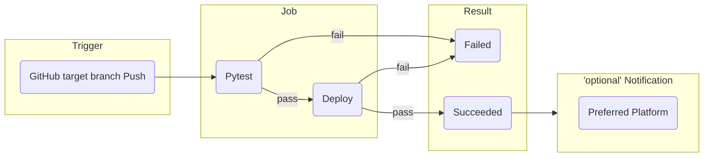

# Cooking Recipe API

## Environment

- Python 3.14
- Django 6.0.2
- Django Rest Framework 3.16.1
- Docker
- GitHub Actions

## Commands

### Docker

```bash
# collect static
docker compose run --rm app sh -c "python manage.py collectstatic"
# ruff format
docker compose run --rm app sh -c "ruff format ."
# ruff lint check
docker compose run --rm app sh -c "ruff check ."
# pyrefly type check
docker compose run --rm app sh -c "pyrefly check"
# test
docker compose run --rm app sh -c "python manage.py test"
```

### Local

```bash
# collect static
uv run manage.py collectstatic
# ruff format
uv run ruff format .
# ruff lint check
uv run ruff check .
# pyrefly type check
uv run pyrefly check
# test
uv run manage.py test
```

## GitHub Actions

### How it works?


