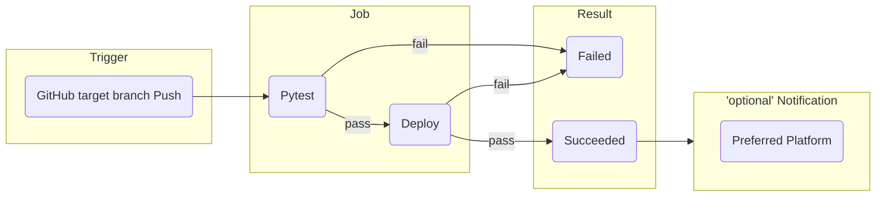

# Cooking Recipe API

## Environment

- Python 3.14
- Django 6.0.2
- Django Rest Framework 3.16.1
- Docker
- GitHub Actions

## Commands

### Docker

```bash
# collect static
docker compose run --rm app sh -c "python manage.py collectstatic"
# ruff format
docker compose run --rm app sh -c "ruff format ."
# ruff lint check
docker compose run --rm app sh -c "ruff check ."
# pyrefly type check
docker compose run --rm app sh -c "pyrefly check"
# test
docker compose run --rm app sh -c "python manage.py test"
```

### Local

```bash
# collect static
uv run manage.py collectstatic
# ruff format
uv run ruff format src/
# ruff lint check
uv run ruff check src/
# pyrefly type check
uv run pyrefly check src/
# test
uv run manage.py test
```

## GitHub Actions

### How it works?



## TDD Theory

Test-Driven Development (TDD) is a software development methodology where tests are written before the actual implementation code. TDD follows a cyclical process known as the **Red-Green-Refactor** cycle.

### The Red-Green-Refactor Cycle

1. **Red Phase**: Write a failing test
   - Create a test that defines the desired behavior of a feature
   - The test fails because the feature hasn't been implemented yet
   - This ensures the test is actually testing something meaningful

2. **Green Phase**: Write minimal code to pass the test
   - Implement the simplest code that makes the failing test pass
   - Focus on functionality, not optimization
   - The goal is to make the test pass, not to write perfect code

3. **Refactor Phase**: Improve code quality
   - Refactor the implementation to improve readability, maintainability, and performance
   - Keep all tests passing during refactoring
   - Remove duplication and adhere to design principles

### Benefits of TDD

- **Improved Code Quality**: Tests catch bugs early and ensure code behaves as expected
- **Better Design**: Writing tests first encourages simpler, more modular designs
- **Confidence in Refactoring**: Comprehensive tests allow safe refactoring of existing code
- **Living Documentation**: Tests serve as executable specifications of how the code should work
- **Reduced Debugging Time**: Issues are caught during development, not during deployment
- **Faster Development Cycle**: Although TDD requires upfront effort, it reduces time spent debugging

### Best Practices

- Write one test at a time before implementing the corresponding feature
- Keep tests focused and isolated (one assertion per test concept)
- Use descriptive test names that explain the expected behavior
- Maintain a high test coverage ratio
- Run tests frequently during development
- Keep tests simple and maintainable

## Test

Django's test framework requires that you create a 'tests' folder inside your Django app directory. This folder must include an '**init**.py' file for Django to recognize it as a module. Additionally, test file names must have the 'test\_' prefix. When you run tests using Django's test command, it automatically executes all tests and clears the test data by creating and then destroying a temporary database for testing.

- Test classes
  1. SimpleTestCase
     - No database integration
     - Useful if no database is required for your test
     - Save time executing tests
  2. TestCase
     - Database integration
     - Useful for testing code that uses the database

### Mocking

Mocking is a technique used in unit testing to isolate the code under test by replacing external dependencies with mock objects. This allows you to:

- **Test in isolation**: Focus on testing a specific component without external dependencies
- **Control external behavior**: Simulate different scenarios (success, failure, edge cases)
- **Speed up tests**: Avoid slow I/O operations like database calls or API requests
- **Verify interactions**: Ensure your code calls dependencies with correct parameters

#### Core Concepts

**unittest.mock** is Python's built-in library for creating mock objects:

1. **Mock**: A flexible object that records how it's used
   - Tracks all method calls and attribute access
   - Returns mock objects for any attribute access
   - Perfect for verifying interactions

2. **MagicMock**: Extends Mock with magic methods support
   - Supports operators, context managers, iteration, etc.
   - Use when mocking objects that need special method support

3. **patch**: A decorator/context manager to replace objects during testing
   - Replaces the target with a MagicMock by default
   - Automatically restores the original after test completes
   - Can be applied to functions, classes, or module-level objects
