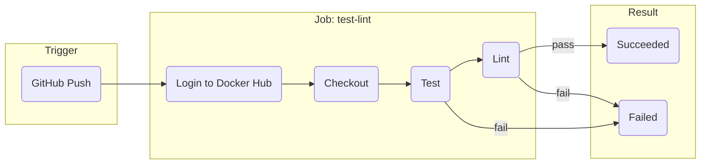

# Cooking Recipe API

## Environment

- Python 3.14
- Django 6.0.2
- Django Rest Framework 3.16.1
- Docker
- GitHub Actions

## Commands

### Docker

```bash
# create migration files from model changes
docker compose run --rm recipe_api sh -c "python manage.py makemigrations"
# apply migrations to database
docker compose run --rm recipe_api sh -c "python manage.py migrate"
# collect static
docker compose run --rm recipe_api sh -c "python manage.py collectstatic"
# ruff format
docker compose run --rm recipe_api sh -c "ruff format ."
# ruff lint check
docker compose run --rm recipe_api sh -c "ruff check ."
# pyrefly type check
docker compose run --rm recipe_api sh -c "pyrefly check"
# test
docker compose run --rm recipe_api sh -c "python manage.py test"
```

### Local

```bash
# create migration files from model changes
uv run src/manage.py makemigrations
# apply migrations to database
uv run src/manage.py migrate
# run server
./dev_server.sh
# collect static
uv run src/manage.py collectstatic
# ruff format, lint, type check
./code_quality.sh
# test
uv run src/manage.py test
```

## API Documentation

The API uses [drf-spectacular](https://drf-spectacular.readthedocs.io/) to generate OpenAPI schema and interactive documentation.

### Endpoints

- **OpenAPI Schema**: `http://localhost:8080/api/v1/schema` — Raw OpenAPI 3.0 schema (JSON)
- **Swagger UI**: `http://localhost:8080/api/v1/docs` — Interactive API documentation with try-it-out functionality

Access these endpoints after starting the server:

```bash
# Local development
./dev_server.sh
# Then visit: http://localhost:8080/api/v1/docs

# With Docker Compose
docker compose up
# Then visit: http://localhost:8080/api/v1/docs
```

## DRF APIView vs ViewSet

`APIView` and `ViewSet` are both DRF abstractions for building APIs, but they fit different use cases.

### APIView

- Maps HTTP methods directly (`get`, `post`, `put`, `patch`, `delete`)
- Best for custom workflows like authentication endpoints (`create`, `token`, `me`) where behavior is not standard CRUD
- Uses explicit URL wiring via `path(...)`

### ViewSet

- Groups resource actions (`list`, `retrieve`, `create`, `update`, `partial_update`, `destroy`) in one class
- Best for model-driven resources (for example: `recipes`, `tags`, `ingredients`)
- Commonly paired with DRF routers to generate RESTful routes automatically

### Rule of Thumb in This Project

- Use `APIView` for auth/session-style endpoints and custom one-off actions.
- Use `ModelViewSet` (or mixin-based ViewSet) for resource collections that need standard CRUD behavior.

## DRF Serializers

Serializers translate between complex Python objects (model instances, querysets) and primitive types that can be rendered into JSON or parsed from an incoming request body. They also perform validation — checking field types, constraints, and cross-field rules before any database write occurs.

### ModelSerializer vs plain Serializer

| Class             | When to use                                                            |
| ----------------- | ---------------------------------------------------------------------- |
| `ModelSerializer` | Model-backed resources where fields mirror DB columns                  |
| `Serializer`      | Non-model data — custom validation, authentication, computed responses |

In this project:

- `RecipeSerializer`, `RecipeDetailSerializer`, `TagSerializer`, `UserSerializer` all extend `ModelSerializer` — they map directly to DB models and auto-derive field types from the model definition.
- `AuthTokenSerializer` extends plain `Serializer` — it validates login credentials and has no corresponding model row.

### Serializer Inheritance (list vs detail)

A common pattern is to define a lightweight list serializer and extend it with a detail serializer that adds heavier fields:

```python
class RecipeSerializer(ModelSerializer):
    class Meta:
        model = Recipe
        fields = ["id", "title", "time_minutes", "price", "link"]
        read_only_fields = ["id"]

class RecipeDetailSerializer(RecipeSerializer):
    class Meta(RecipeSerializer.Meta):          # inherits model + read_only_fields
        fields = RecipeSerializer.Meta.fields + ["description"]
```

`RecipeDetailSerializer.Meta` subclasses `RecipeSerializer.Meta` so `model` and `read_only_fields` are inherited automatically — only `fields` is widened to include `description`. The ViewSet selects the right serializer based on the action:

```python
def get_serializer_class(self):
    if self.action == "list":
        return RecipeSerializer       # lightweight: no description
    return RecipeDetailSerializer     # full: includes description
```

This avoids sending multi-kilobyte description fields in every row of a paginated list response.

### Nested Serializers

A nested serializer embeds a related object's full representation inside a parent serializer's output instead of returning only a foreign key integer. The `Recipe` model has a `ManyToManyField` to `Tag`. Without nesting, DRF outputs only a list of tag PKs:

```json
{ "id": 1, "title": "Pasta", "tags": [3, 7] }
```

With a nested `TagSerializer`, the full tag objects appear inline:

```json
{
  "id": 1,
  "title": "Pasta",
  "tags": [
    { "id": 3, "name": "Italian" },
    { "id": 7, "name": "Quick" }
  ]
}
```

To add nested read-only tags to `RecipeDetailSerializer`:

```python
class RecipeDetailSerializer(RecipeSerializer):
    tags = TagSerializer(many=True, read_only=True)

    class Meta(RecipeSerializer.Meta):
        fields = RecipeSerializer.Meta.fields + ["description", "tags"]
```

`many=True` tells DRF to iterate over the M2M queryset and serialize each item. `read_only=True` makes the embedded list output-only — write operations use a separate endpoint.

### Writable Nested Serializers

Making nested objects writable adds complexity: DRF cannot automatically infer how to create or update nested rows. You must override `create()` and `update()` on the parent serializer:

```python
def create(self, validated_data):
    tags_data = validated_data.pop("tags", [])
    recipe = Recipe.objects.create(**validated_data)
    recipe.tags.set([tag["id"] for tag in tags_data])
    return recipe

def update(self, instance, validated_data):
    tags_data = validated_data.pop("tags", None)
    instance = super().update(instance, validated_data)
    if tags_data is not None:
        instance.tags.set([tag["id"] for tag in tags_data])
    return instance
```

In this project, `Tag` objects are managed through their own dedicated `/api/v1/tag` endpoint — writable nested serializers are intentionally avoided to keep each serializer's responsibility narrow.

## Django Migrations

- **makemigrations**: Detects model changes and creates new migration files in each app's `migrations/` directory.
- **migrate**: Applies unapplied migration files to the database so the schema matches the current Django models.
- Recommended order: run `makemigrations` first, then run `migrate`.

## GitHub Actions

### How it works


```mermaid
flowchart LR
    subgraph Trigger
        A(GitHub Push)
    end
    A --> B
    subgraph Job[Job: test-lint]
        B(Login to Docker Hub) --> C(Checkout)
        C --> D(Test)
        D --> E(Lint)
    end
    E --pass--> F
    E --fail--> G
    D --fail--> G
    subgraph Result
        F(Succeeded)
        G(Failed)
    end
```

## Authentication

Django REST Framework supports four authentication strategies. This project uses **Token Authentication**.

### 1. Basic Authentication

```
Authorization: Basic base64(email:password)
```

Credentials are sent with every request. The server decodes and validates them against the database each time.

- **Pros**: Simple, stateless, no server-side storage needed
- **Cons**: Credentials travel on every request (requires HTTPS); no way to log out without changing the password
- **DRF class**: `BasicAuthentication`

### 2. Token Authentication ← this project uses

```
# Login — exchange credentials for a token
POST /api/v1/user/token  { "email": "...", "password": "..." }
← { "token": "abc123..." }

# Subsequent requests — send token in header
Authorization: Token abc123...
```

On login the server generates a random opaque token and stores it in the `authtoken_token` table. The client stores it and sends it in the `Authorization` header on every subsequent request.

- **Pros**: Credentials sent only once; tokens are revokable by deleting the DB row; built into DRF with no extra dependencies
- **Cons**: Tokens never expire by default; requires a DB lookup on every authenticated request
- **DRF class**: `TokenAuthentication`

### 3. JWT (JSON Web Token)

```
# Login — receive short-lived access token + long-lived refresh token
POST /api/token  { "email": "...", "password": "..." }
← { "access": "eyJ...", "refresh": "eyJ..." }

# Subsequent requests
Authorization: Bearer eyJ...

# When access token expires, use refresh token to get a new one
POST /api/token/refresh  { "refresh": "eyJ..." }
← { "access": "eyJ..." }
```

The server signs a JSON payload with a secret key. No DB lookup is needed per request — the server only verifies the signature. The access token is short-lived (minutes); the refresh token is long-lived.

- **Pros**: Stateless — no DB lookup per request, scales horizontally; built-in expiry
- **Cons**: Cannot revoke tokens before expiry without a blocklist (which reintroduces DB lookups); payload is base64-encoded, not encrypted
- **DRF library**: `djangorestframework-simplejwt`

### 4. Session Authentication

```
# Login — server creates a session record and sends a session ID cookie
POST /api/login  { "username": "...", "password": "..." }
← Set-Cookie: sessionid=xyz

# Browser sends cookie automatically on subsequent requests
Cookie: sessionid=xyz
```

Django's built-in session framework stores session data server-side (DB or cache) and identifies the user via a cookie. Used by Django Admin.

- **Pros**: Easy with Django's built-in system; cookies are sent automatically by browsers
- **Cons**: Stateful — sessions stored server-side; cookie-based (CSRF protection required); not suitable for mobile apps or third-party API clients
- **DRF class**: `SessionAuthentication`

### Comparison

| Strategy | Stateless | Revokable | Expiry | Extra dependency |
| -------- | --------- | --------- | ------ | ---------------- |
| Basic    | Yes       | No        | No     | None             |
| Token    | No        | Yes       | No     | None (built-in)  |
| JWT      | Yes       | Partial   | Yes    | simplejwt        |
| Session  | No        | Yes       | Yes    | None             |

## TDD Theory

Test-Driven Development (TDD) is a software development methodology where tests are written before the actual implementation code. TDD follows a cyclical process known as the **Red-Green-Refactor** cycle.

### The Red-Green-Refactor Cycle

1. **Red Phase**: Write a failing test
   - Create a test that defines the desired behavior of a feature
   - The test fails because the feature hasn't been implemented yet
   - This ensures the test is actually testing something meaningful

2. **Green Phase**: Write minimal code to pass the test
   - Implement the simplest code that makes the failing test pass
   - Focus on functionality, not optimization
   - The goal is to make the test pass, not to write perfect code

3. **Refactor Phase**: Improve code quality
   - Refactor the implementation to improve readability, maintainability, and performance
   - Keep all tests passing during refactoring
   - Remove duplication and adhere to design principles

### Benefits of TDD

- **Improved Code Quality**: Tests catch bugs early and ensure code behaves as expected
- **Better Design**: Writing tests first encourages simpler, more modular designs
- **Confidence in Refactoring**: Comprehensive tests allow safe refactoring of existing code
- **Living Documentation**: Tests serve as executable specifications of how the code should work
- **Reduced Debugging Time**: Issues are caught during development, not during deployment
- **Faster Development Cycle**: Although TDD requires upfront effort, it reduces time spent debugging

### Best Practices

- Write one test at a time before implementing the corresponding feature
- Keep tests focused and isolated (one assertion per test concept)
- Use descriptive test names that explain the expected behavior
- Maintain a high test coverage ratio
- Run tests frequently during development
- Keep tests simple and maintainable

## Test

Django's test framework requires that you create a 'tests' folder inside your Django app directory. This folder must include an '**init**.py' file for Django to recognize it as a module. Additionally, test file names must have the 'test\_' prefix. When you run tests using Django's test command, it automatically executes all tests and clears the test data by creating and then destroying a temporary database for testing.

- Test classes
  1. SimpleTestCase
     - No database integration
     - Useful if no database is required for your test
     - Save time executing tests
  2. TestCase
     - Database integration
     - Useful for testing code that uses the database

### Mocking

Mocking is a technique used in unit testing to isolate the code under test by replacing external dependencies with mock objects. This allows you to:

- **Test in isolation**: Focus on testing a specific component without external dependencies
- **Control external behavior**: Simulate different scenarios (success, failure, edge cases)
- **Speed up tests**: Avoid slow I/O operations like database calls or API requests
- **Verify interactions**: Ensure your code calls dependencies with correct parameters

#### Core Concepts

**unittest.mock** is Python's built-in library for creating mock objects:

1. **Mock**: A flexible object that records how it's used
   - Tracks all method calls and attribute access
   - Returns mock objects for any attribute access
   - Perfect for verifying interactions

2. **MagicMock**: Extends Mock with magic methods support
   - Supports operators, context managers, iteration, etc.
   - Use when mocking objects that need special method support

3. **patch**: A decorator/context manager to replace objects during testing
   - Replaces the target with a MagicMock by default
   - Automatically restores the original after test completes
   - Can be applied to functions, classes, or module-level objects
