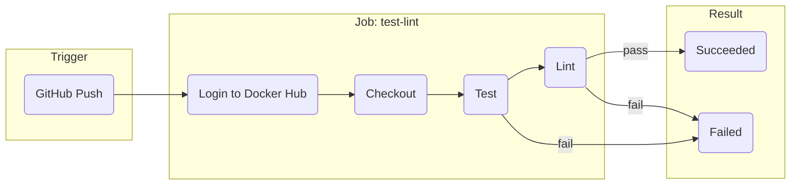

# Cooking Recipe API

## 환경

- Python 3.14
- Django 6.0.5
- Django REST Framework 3.17.1
- Docker
- GitHub Actions

## 명령어

### Docker

```bash
# 모델 변경 사항으로부터 migration 파일 생성
docker compose run --rm recipe_api sh -c "python manage.py makemigrations"
# database에 migration 적용
docker compose run --rm recipe_api sh -c "python manage.py migrate"
# static 파일 수집
docker compose run --rm recipe_api sh -c "python manage.py collectstatic"
# ruff format
docker compose run --rm recipe_api sh -c "ruff format ."
# ruff lint check
docker compose run --rm recipe_api sh -c "ruff check ."
# pyrefly type check
docker compose run --rm recipe_api sh -c "pyrefly check"
# test
docker compose run --rm recipe_api sh -c "python manage.py test"
```

### Local

```bash
# 모델 변경 사항으로부터 migration 파일 생성
uv run src/manage.py makemigrations
# database에 migration 적용
uv run src/manage.py migrate
# server 실행
./dev_server.sh
# static 파일 수집
uv run src/manage.py collectstatic
# ruff format, lint, type check
./code_quality.sh
# test
uv run src/manage.py test src/
```

## API 문서

이 API는 [drf-spectacular](https://drf-spectacular.readthedocs.io/)를 사용해 OpenAPI schema와 대화형 문서를 생성합니다.

### 엔드포인트

- **OpenAPI Schema**: `http://localhost:8080/api/v1/schema` — 원본 OpenAPI 3.0 schema(JSON)
- **Swagger UI**: `http://localhost:8080/api/v1/docs` — try-it-out 기능이 포함된 대화형 API 문서

서버를 시작한 뒤 다음 endpoint에 접근할 수 있습니다.

```bash
# Local development
./dev_server.sh
# 이후 방문: http://localhost:8080/api/v1/docs

# Docker Compose 사용
docker compose up
# 이후 방문: http://localhost:8080/api/v1/docs
```

## Django Static 및 Media 파일

Django는 두 종류의 non-Python 파일을 사용합니다.

- **Static files**: CSS, JavaScript, 이미지, 아이콘, 그리고 프로젝트 또는 installed app에 포함된 기타 asset입니다.
- **Media files**: application 실행 중 사용자가 upload한 파일입니다.

이 프로젝트는 REST API이므로 custom static file을 직접 정의하지 않습니다. 다만 Django Admin, DRF, drf-spectacular 같은 installed app에서는 여전히 static file을 사용합니다.

현재 설정:

```python
STATIC_URL = '/static/static/'
MEDIA_URL = '/static/media/'
STATIC_ROOT = 'django_static/static/'
MEDIA_ROOT = 'django_static/media/'
```

`STATIC_URL`은 Django가 static asset에 사용하는 URL prefix입니다. `MEDIA_URL`은 upload media file에 사용하는 URL prefix입니다. `STATIC_ROOT`와 `MEDIA_ROOT`는 각각 `collectstatic` 결과물과 user upload file이 저장되는 filesystem path입니다.

production에 가까운 serving 방식에서는 보통 Django가 static file을 하나의 directory로 collect하고, Nginx 같은 reverse proxy가 filesystem에서 해당 파일을 serve합니다.

- `collectstatic`은 installed app의 static file을 `STATIC_ROOT`로 모읍니다.
- Media upload에는 `MEDIA_URL`과 `MEDIA_ROOT`가 필요합니다.
- 현재 `settings.py`에서는 Docker용 `/mnt/django/web/...` 값이 주석 처리되어 있고, effective 값은 local용 `django_static/static/`, `django_static/media/`입니다.

## DRF APIView vs ViewSet

`APIView`와 `ViewSet`은 API를 만들기 위한 DRF abstraction이지만, 적합한 use case가 다릅니다.

### APIView

- HTTP method를 직접 mapping합니다(`get`, `post`, `put`, `patch`, `delete`).
- 표준 CRUD가 아닌 authentication endpoint(`create`, `token`, `me`) 같은 custom workflow에 적합합니다.
- `path(...)`를 통한 명시적인 URL wiring을 사용합니다.

### ViewSet

- resource action(`list`, `retrieve`, `create`, `update`, `partial_update`, `destroy`)을 하나의 class로 묶습니다.
- model-driven resource에 적합합니다. 예: `recipes`, `tags`, `ingredients`
- 보통 DRF router와 함께 사용해 RESTful route를 자동 생성합니다.

### 이 프로젝트의 기준

- auth/session 성격의 endpoint와 custom one-off action에는 `APIView`를 사용합니다.
- 표준 CRUD behavior가 필요한 resource collection에는 `ModelViewSet` 또는 mixin 기반 ViewSet을 사용합니다.

## DRF Serializers

Serializer는 복잡한 Python object(model instance, queryset)와 JSON으로 rendering하거나 incoming request body에서 parsing할 수 있는 primitive type 사이를 변환합니다. 또한 database write가 발생하기 전에 field type, constraint, cross-field rule을 확인하는 validation도 수행합니다.

### ModelSerializer vs plain Serializer

| 클래스            | 사용 시점                                                             |
| ----------------- | --------------------------------------------------------------------- |
| `ModelSerializer` | field가 DB column과 대응되는 model-backed resource                    |
| `Serializer`      | non-model data — custom validation, authentication, computed response |

이 프로젝트에서는 다음과 같이 사용합니다.

- `RecipeSerializer`, `RecipeDetailSerializer`, `TagSerializer`, `IngredientSerializer`, `UserSerializer`는 모두 `ModelSerializer`를 확장합니다. 이들은 DB model에 직접 mapping되며 model definition에서 field type을 자동으로 추론합니다.
- `AuthTokenSerializer`는 plain `Serializer`를 확장합니다. login credential을 validate하며 대응되는 model row가 없습니다.

### Serializer Inheritance (list vs detail)

일반적인 pattern은 가벼운 list serializer를 정의하고, 더 무거운 field를 추가하는 detail serializer로 확장하는 것입니다.

```python
class RecipeSerializer(ModelSerializer):
    tags = TagSerializer(many=True, required=False)
    ingredients = IngredientSerializer(many=True, required=False)

    class Meta:
        model = Recipe
        fields = [
            "id",
            "title",
            "time_minutes",
            "price",
            "link",
            "tags",
            "ingredients",
        ]
        read_only_fields = ["id"]

class RecipeDetailSerializer(RecipeSerializer):
    class Meta(RecipeSerializer.Meta):          # model + read_only_fields를 상속
        fields = RecipeSerializer.Meta.fields + ["description"]
```

`RecipeDetailSerializer.Meta`는 `RecipeSerializer.Meta`를 subclass하므로 `model`과 `read_only_fields`를 자동으로 상속합니다. `fields`만 `description`을 포함하도록 확장합니다. ViewSet은 action에 따라 알맞은 serializer를 선택합니다.

```python
def get_serializer_class(self):
    if self.action == "list":
        return RecipeSerializer       # lightweight: description 없음
    return RecipeDetailSerializer     # full: description 포함
```

이렇게 하면 paginated list response의 모든 row에 multi-kilobyte description field를 보내는 것을 피할 수 있습니다.

### Nested Serializers

nested serializer는 parent serializer의 output에서 related object를 foreign key integer만 반환하는 대신 전체 representation으로 embedding합니다. `Recipe` model은 `Tag`와 `Ingredient`에 대한 `ManyToManyField`를 가집니다. nesting이 없으면 DRF는 tag PK list만 출력합니다.

```json
{ "id": 1, "title": "Pasta", "tags": [3, 7] }
```

nested `TagSerializer`를 사용하면 전체 tag object가 inline으로 나타납니다.

```json
{
  "id": 1,
  "title": "Pasta",
  "tags": [
    { "id": 3, "name": "Italian" },
    { "id": 7, "name": "Quick" }
  ]
}
```

이 프로젝트의 `RecipeSerializer`는 `tags`와 `ingredients`를 nested field로 정의합니다.

```python
class RecipeSerializer(ModelSerializer):
    tags = TagSerializer(many=True, required=False)
    ingredients = IngredientSerializer(many=True, required=False)
```

`many=True`는 DRF가 M2M queryset을 순회하면서 각 item을 serialize하도록 합니다. `required=False`는 recipe 생성 또는 수정 시 해당 nested field를 생략할 수 있게 합니다.

### Writable Nested Serializers

nested object를 writable하게 만들면 복잡도가 올라갑니다. DRF의 기본 `ModelSerializer.create()`와 `ModelSerializer.update()`는 writable nested representation을 지원하지 않으므로, parent serializer에서 `create()`와 `update()`를 명시적으로 구현해야 합니다.

```python
def create(self, validated_data):
    tags = validated_data.pop("tags", [])
    ingredients = validated_data.pop("ingredients", [])
    recipe = super().create(validated_data)
    auth_user = self.context["request"].user
    for tag_data in tags:
        tag, _ = Tag.objects.get_or_create(user=auth_user, name=tag_data["name"])
        recipe.tags.add(tag)
    for ingredient_data in ingredients:
        ingredient, _ = Ingredient.objects.get_or_create(
            user=auth_user,
            name=ingredient_data["name"],
        )
        recipe.ingredients.add(ingredient)
    return recipe

def update(self, instance, validated_data):
    tags = validated_data.pop("tags", None)
    ingredients = validated_data.pop("ingredients", None)
    auth_user = self.context["request"].user

    if tags is not None:
        instance.tags.clear()
        for tag_data in tags:
            tag, _ = Tag.objects.get_or_create(user=auth_user, name=tag_data["name"])
            instance.tags.add(tag)
    if ingredients is not None:
        instance.ingredients.clear()
        for ingredient_data in ingredients:
            ingredient, _ = Ingredient.objects.get_or_create(
                user=auth_user,
                name=ingredient_data["name"],
            )
            instance.ingredients.add(ingredient)

    for attr, value in validated_data.items():
        setattr(instance, attr, value)
    instance.save()
    return instance
```

중요한 detail은 두 가지입니다.

- `create()`의 `pop("tags", [])` / `pop("ingredients", [])`와 `update()`의 `pop("tags", None)` / `pop("ingredients", None)` — `update()`에서 `None`을 sentinel로 사용하면 "client가 field를 생략함"(그대로 둠)과 "client가 빈 list를 보냄"(모두 제거)을 구분할 수 있습니다. `[]`를 default로 사용하면 해당 field를 생략한 PATCH에서도 M2M relation이 조용히 모두 지워질 수 있습니다.
- `create` 대신 `get_or_create` 사용 — tag/ingredient assignment를 idempotent하게 만듭니다. 두 recipe가 같은 tag 또는 ingredient name을 참조할 수 있고, 같은 name을 다시 post해도 안전합니다.

이 프로젝트에서 `Tag`와 `Ingredient` object는 전용 `/api/v1/recipe/tags/`, `/api/v1/recipe/ingredients/` endpoint를 통해 list/update/delete할 수도 있습니다. create는 recipe create/update에서 nested payload를 통해 암묵적으로 처리합니다.

## Django Migrations

- **makemigrations**: model 변경 사항을 감지하고 각 app의 `migrations/` directory에 새 migration file을 생성합니다.
- **migrate**: 아직 적용되지 않은 migration file을 database에 적용해 schema가 현재 Django model과 일치하도록 합니다.
- 권장 순서: 먼저 `makemigrations`를 실행한 뒤 `migrate`를 실행합니다.

## GitHub Actions

### 동작 방식


```mermaid
flowchart LR
    subgraph Trigger
        A(GitHub Push)
    end
    A --> B
    subgraph Job[Job: test-lint]
        B(Login to Docker Hub) --> C(Checkout)
        C --> D(Test)
        D --> E(Lint)
    end
    E --pass--> F
    E --fail--> G
    D --fail--> G
    subgraph Result
        F(Succeeded)
        G(Failed)
    end
```

## 인증

Django REST Framework는 여러 authentication scheme을 지원합니다. 이 README에서는 대표적인 네 가지 방식을 비교하며, 이 프로젝트는 **Token Authentication**을 사용합니다.

### 1. Basic Authentication

```
Authorization: Basic base64(email:password)
```

credential은 매 request마다 전송됩니다. server는 매번 이를 decode하고 database와 대조해 validate합니다.

- **장점**: 단순하고 stateless하며 server-side storage가 필요 없습니다.
- **단점**: credential이 매 request마다 전송됩니다(HTTPS 필요). password를 변경하지 않고는 logout할 방법이 없습니다.
- **DRF 클래스**: `BasicAuthentication`

### 2. Token Authentication ← 이 프로젝트에서 사용

```
# Login — credential을 token으로 교환
POST /api/v1/user/token  { "email": "...", "password": "..." }
← { "token": "abc123..." }

# 이후 request — header에 token 전송
Authorization: Token abc123...
```

login 시 server는 random opaque token을 생성하고 `authtoken_token` table에 저장합니다. client는 이 token을 저장한 뒤 이후 모든 request의 `Authorization` header에 보냅니다.

- **장점**: credential은 한 번만 전송됩니다. DB row를 삭제해 token을 revoke할 수 있습니다. 추가 dependency 없이 DRF에 내장되어 있습니다.
- **단점**: 기본적으로 token이 만료되지 않습니다. authenticated request마다 DB lookup이 필요합니다.
- **DRF 클래스**: `TokenAuthentication`

### 3. JWT (JSON Web Token)

```
# Login — 짧게 유지되는 access token + 오래 유지되는 refresh token 수신
POST /api/token  { "email": "...", "password": "..." }
← { "access": "eyJ...", "refresh": "eyJ..." }

# 이후 request
Authorization: Bearer eyJ...

# access token이 만료되면 refresh token으로 새 access token 발급
POST /api/token/refresh  { "refresh": "eyJ..." }
← { "access": "eyJ..." }
```

server는 secret key로 JSON payload에 sign합니다. request마다 DB lookup은 필요 없으며, server는 signature만 verify합니다. access token은 짧게 유지되고(분 단위), refresh token은 오래 유지됩니다.

- **장점**: stateless합니다. request마다 DB lookup이 없어 horizontal scale에 유리합니다. expiry가 내장되어 있습니다.
- **단점**: blocklist 없이는 expiry 전에 token을 revoke할 수 없습니다(blocklist를 쓰면 DB lookup이 다시 필요해집니다). payload는 base64로 encoding될 뿐 encryption되지는 않습니다.
- **DRF library**: `djangorestframework-simplejwt`

### 4. Session Authentication

```
# Login — server가 session record를 만들고 session ID cookie를 전송
POST /api/login  { "username": "...", "password": "..." }
← Set-Cookie: sessionid=xyz

# browser는 이후 request에서 cookie를 자동 전송
Cookie: sessionid=xyz
```

Django의 built-in session framework는 session data를 server-side(DB 또는 cache)에 저장하고 cookie로 user를 식별합니다. Django Admin에서 사용됩니다.

- **장점**: Django built-in system으로 쉽게 사용할 수 있습니다. browser가 cookie를 자동으로 보냅니다.
- **단점**: stateful합니다. session이 server-side에 저장됩니다. cookie 기반이므로 CSRF protection이 필요합니다. mobile app이나 third-party API client에는 적합하지 않습니다.
- **DRF 클래스**: `SessionAuthentication`

### 비교

| 방식    | Stateless | Revokable | Expiry | 추가 dependency |
| ------- | --------- | --------- | ------ | --------------- |
| Basic   | Yes       | No        | No     | None            |
| Token   | No        | Yes       | No     | None (built-in) |
| JWT     | Yes       | Partial   | Yes    | simplejwt       |
| Session | No        | Yes       | Yes    | None            |

## TDD 이론

Test-Driven Development(TDD)는 실제 implementation code를 작성하기 전에 test를 먼저 작성하는 software development methodology입니다. TDD는 **Red-Green-Refactor** cycle이라고 알려진 순환 process를 따릅니다.

### Red-Green-Refactor Cycle

1. **Red Phase**: 실패하는 test 작성
   - feature의 desired behavior를 정의하는 test를 만듭니다.
   - feature가 아직 구현되지 않았으므로 test는 실패합니다.
   - 이를 통해 test가 실제로 의미 있는 것을 검증하고 있음을 보장합니다.

2. **Green Phase**: test를 통과시키는 최소 code 작성
   - 실패하는 test를 통과시키는 가장 단순한 code를 구현합니다.
   - optimization이 아니라 functionality에 집중합니다.
   - 목표는 완벽한 code를 쓰는 것이 아니라 test를 통과시키는 것입니다.

3. **Refactor Phase**: code quality 개선
   - readability, maintainability, performance를 개선하도록 implementation을 refactor합니다.
   - refactoring 중에도 모든 test가 계속 통과하도록 유지합니다.
   - duplication을 제거하고 design principle을 따릅니다.

### TDD의 장점

- **Improved Code Quality**: test가 bug를 조기에 잡고 code가 예상대로 동작하도록 보장합니다.
- **Better Design**: test를 먼저 작성하면 더 단순하고 modular한 design을 유도합니다.
- **Confidence in Refactoring**: comprehensive test는 기존 code를 안전하게 refactor할 수 있게 합니다.
- **Living Documentation**: test는 code가 어떻게 동작해야 하는지에 대한 executable specification 역할을 합니다.
- **Reduced Debugging Time**: issue가 deployment 중이 아니라 development 중에 잡힙니다.
- **Faster Development Cycle**: TDD는 upfront effort가 필요하지만 debugging에 쓰는 시간을 줄입니다.

### Best Practices

- 대응되는 feature를 구현하기 전에 test를 한 번에 하나씩 작성합니다.
- test를 focused하고 isolated하게 유지합니다(하나의 test concept마다 하나의 assertion).
- expected behavior를 설명하는 descriptive test name을 사용합니다.
- 높은 test coverage ratio를 유지합니다.
- development 중 test를 자주 실행합니다.
- test를 단순하고 maintainable하게 유지합니다.

## 테스트

이 프로젝트는 각 Django app directory 안에 `tests` folder를 두고 test file name에 `test_` prefix를 붙이는 구조를 사용합니다. `tests` folder에는 Django가 module로 인식할 수 있도록 `__init__.py` file이 포함되어야 합니다. Django test command를 실행하면 발견된 test를 실행하고, testing을 위한 temporary database를 생성한 뒤 삭제하여 test data를 정리합니다.

- 테스트 클래스
  1. SimpleTestCase
     - Database integration 없음
     - test에 database가 필요하지 않을 때 유용합니다.
     - test 실행 시간을 줄입니다.
  2. TestCase
     - Database integration 있음
     - database를 사용하는 code를 test할 때 유용합니다.

### Mocking

Mocking은 unit testing에서 external dependency를 mock object로 대체해 test 대상 code를 isolate하는 technique입니다. 이를 통해 다음을 할 수 있습니다.

- **Test in isolation**: external dependency 없이 특정 component test에 집중합니다.
- **Control external behavior**: 다양한 scenario(success, failure, edge case)를 simulate합니다.
- **Speed up tests**: database call이나 API request 같은 느린 I/O operation을 피합니다.
- **Verify interactions**: code가 dependency를 올바른 parameter로 호출하는지 확인합니다.

#### Core Concepts

**unittest.mock**은 mock object를 만들기 위한 Python built-in library입니다.

1. **Mock**: 사용 방식을 기록하는 flexible object
   - 모든 method call과 attribute access를 추적합니다.
   - 어떤 attribute access에 대해서도 mock object를 반환합니다.
   - interaction 검증에 적합합니다.

2. **MagicMock**: magic method support를 포함하도록 Mock을 확장
   - operator, context manager, iteration 등을 지원합니다.
   - special method support가 필요한 object를 mocking할 때 사용합니다.

3. **patch**: testing 중 object를 대체하는 decorator/context manager
   - 기본적으로 target을 MagicMock으로 대체합니다.
   - test가 끝난 뒤 원래 object를 자동으로 복원합니다.
   - function, class, module-level object에 적용할 수 있습니다.
